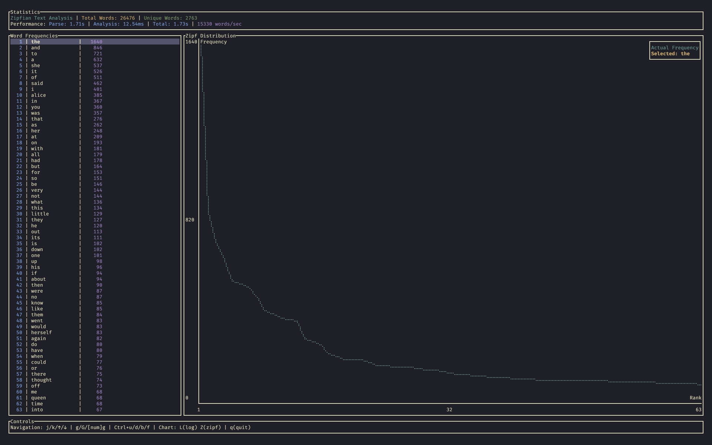

<div align="center">

# Zipfr

**A blazingly fast Zipfian text analysis tool with interactive TUI**

[](https://www.rust-lang.org)
[](LICENSE)
[]()

[Features](#-features) • [Installation](#-installation) • [Usage](#-usage) • [Examples](#-examples) • [Contributing](#-contributing)

</div>

---

## 🎯 What is Zipfr?

Zipfr is a high-performance command-line tool for analyzing text according to **Zipf's law** - the observation that word frequency follows a power-law distribution. Built in Rust for speed and reliability, it features an interactive terminal interface with real-time visualization.

> **Zipf's Law**: In natural language, the frequency of any word is inversely proportional to its rank. The most frequent word appears ~2× more than the 2nd, ~3× more than the 3rd, and so on.


<div align="center">
  
</div>

## ✨ Features

### 🚀 **Performance**
- **Blazingly fast** word counting with HashMap-based O(1) lookups
- **Memory efficient** streaming for large files
- **Sub-second analysis** of most text files
- **Benchmarking metrics** showing words/second processing speed

### 🎨 **Interactive TUI (Default)**
- **Dynamic Zipf distribution chart** with perfect list-chart synchronization
- **Advanced Vim-like navigation** (`j/k`, `g/G`, `Ctrl+u/d/f/b`, `h/l`)
- **Intelligent search** (`/`) with fuzzy matching and `n/N` navigation
- **Visual cursor** with color-coded Zipf fit indicators
- **Log-log scale visualization** (`L`) - proper academic standard for power laws
- **Dual chart scope modes** (`A`):
  - **Visible Range**: Detailed analysis of current view
  - **All Data**: Complete corpus overview from rank 1 to N
- **Dual Zipf reference lines** (`Z`):
  - **Absolute**: Based on corpus-wide rank 1 frequency
  - **Relative**: Based on visible/chart range for local analysis
- **Goodness of fit analysis** with color-coded deviation indicators
- **Responsive layout** adapting to terminal width

### 📊 **Advanced Analysis Features**
- **Log-log scale visualization** - Academic standard for power law analysis
- **Dual-scope analysis**:
  - **Micro-analysis**: Focus on specific rank ranges
  - **Macro-analysis**: Complete corpus-wide distribution
- **Zipf law adherence analysis** with color-coded fit indicators:
  - 🟢 **Green**: Perfect fit (±10%)
  - 🟡 **Yellow**: Good fit (±30%)
  - 🔵 **Blue/Red**: Extreme deviations
- **Real-time chart synchronization** between list and visualization
- **Customizable output** (top N words)
- **CSV export** for further analysis
- **Clean text parsing** handling punctuation and normalization
- **Real-time performance metrics**

### 🏷️ **Intelligent Tagging & Filtering System**
- **Comprehensive word tagging** with 6 built-in categories:
  - **Stop Words**: Common function words (the, and, of, etc.)
  - **Sentiment**: Positive and negative emotional words
  - **Academic**: Scholarly and technical terminology
  - **Temporal**: Time-related words (now, then, during, etc.)
  - **Quantitative**: Numbers and measurement words
- **Visual tag indicators** showing `[S,P,A]` letters with color coding
- **Intuitive two-step filtering**:
  - **Step 1**: Select tag category (`F` → number)
  - **Step 2**: Choose exclude (hide) or include (show only)
- **Quick stop word toggle** (`S`) for instant common word filtering
- **TOML-based configuration** for easy tag customization
- **Zero performance impact** - tags applied once during analysis

## 🛠 Installation

### Prerequisites
- **Rust 1.70+** - Install from [rustup.rs](https://rustup.rs/)

### From Source
```bash
git clone https://github.com/joshroyelliott/zipfr.git
cd zipfr
cargo build --release
```

### Using Cargo
```bash
cargo install zipfr
```

## 🚀 Usage

### Interactive Mode (Default)
```bash
# Launch interactive TUI (default)
zipfr document.txt

# With options
zipfr document.txt --top 100 --output analysis.csv
```

### CLI Mode
```bash
# Traditional output for scripts/automation
zipfr document.txt --no-interactive

# Quick analysis
zipfr document.txt --no-interactive --top 10

# Custom dataset name
zipfr data.txt --name "Customer Feedback Analysis"

# Piped input with meaningful name
cat document.txt | zipfr /dev/stdin --name "Alice in Wonderland"
```

## 📖 Examples

### Basic Analysis
```bash
# Analyze Alice in Wonderland with proper title
curl -s https://www.gutenberg.org/files/11/11-0.txt | zipfr /dev/stdin --name "Alice's Adventures in Wonderland"

# Analyze local file with custom name
zipfr corpus.txt --name "Shakespeare Complete Works"
```

### Advanced Analysis Workflow
```bash
# 1. Launch interactive analysis
zipfr document.txt

# 2. In the TUI:
#    - Press 'A' to view entire corpus distribution
#    - Press 'L' to enable log-log scale (academic standard)
#    - Press 'Z' to add Zipf reference lines
#    - Use '/' to search for specific words
#    - Navigate with j/k to examine different rank ranges

# 3. Export results for further analysis
zipfr document.txt --no-interactive --output analysis.csv
```

### Tag Filtering Examples
```bash
# 1. Launch analysis and filter out common words
zipfr document.txt
# In TUI: Press 'S' to quickly hide stop words

# 2. Focus on positive sentiment words only
zipfr document.txt  
# In TUI: Press 'F' → '2' → 'i' to show only positive words

# 3. Exclude academic jargon for readability analysis
zipfr document.txt
# In TUI: Press 'F' → '4' → 'e' to hide academic terms

# 4. Analyze temporal language patterns
zipfr document.txt
# In TUI: Press 'F' → '5' → 'i' to show only temporal words
```

### Interactive Features
<div align="center">

| Key | Action | Description |
|-----|--------|-------------|
| **Navigation** | | |
| `j/k` `↑/↓` | Move | Line by line navigation |
| `h/l` | Move | Alternative line navigation |
| `g` / `G` | Jump | Go to top/bottom |
| `[num]g` | Goto | Jump to specific rank |
| `Ctrl+u/d` | Page | Half page up/down |
| `Ctrl+f/b` | Page | Full page up/down |
| **Search** | | |
| `/` | Search | Fuzzy search with live results |
| `n/N` | Navigate | Next/previous search match |
| **Chart Controls** | | |
| `L` | Log Scale | Toggle log-log visualization |
| `A` | Chart Scope | Toggle: Visible Range ↔ All Data |
| `Z` | Zipf Lines | Cycle: Off → Absolute → Relative |
| **Filtering** | | |
| `F` | Filter Menu | Two-step tag filtering interface |
| `S` | Stop Words | Quick toggle stop word filter |
| `c` | Clear | Clear all active filters |
| **General** | | |
| `q` | Quit | Exit application |

</div>

### Sample Output
```
Zipfian Text Analysis Results
============================
Total words: 26,476
Unique words: 2,763

Performance Metrics:
  File parsing: 28.13ms
  Word analysis: 17.98ms  
  Total processing: 46.12ms
  Words per second: 574,038

Rank | Word                 |    Count
-----+----------------------+---------
   1 | the                  |     1640
   2 | and                  |      846
   3 | to                   |      721
   4 | a                    |      632
   5 | she                  |      537
```

## 📋 Command Line Options

```
Usage: zipfr [OPTIONS] <FILE>

Arguments:
  <FILE>  Path to the text file to analyze

Options:
  -n, --name <NAME>            Custom name for the dataset (overrides filename)
  -t, --top <TOP>              Display top N words [default: 20]
      --no-interactive         Disable interactive TUI mode (use CLI output)
  -o, --output <OUTPUT>        Output results to file
  -h, --help                   Print help
  -V, --version                Print version
```

## 🏷️ Tag Configuration

Zipfr uses a `tags.toml` file to define word categories. The default configuration includes:

```toml
[[tags]]
name = "Stop Words"
letter = "S"
words = ["the", "and", "of", "to", "a", "in", "is", "it", "you", "that", ...]

[[tags]]
name = "Positive"
letter = "P" 
words = ["good", "great", "excellent", "amazing", "wonderful", "fantastic", ...]

[[tags]]
name = "Negative"
letter = "N"
words = ["bad", "terrible", "awful", "horrible", "disappointing", ...]

# ... additional tag categories
```

### Customizing Tags
1. **Edit existing tags**: Modify word lists in `tags.toml`
2. **Add new categories**: Create new `[[tags]]` sections
3. **Visual indicators**: Each tag shows its letter in the word list (`[S,P,A]`)
4. **Performance**: Tags are loaded once at startup for optimal speed

## 🏗 Architecture

<details>
<summary>Project Structure</summary>

```
src/
├── main.rs          # CLI entry point and application logic
├── lib.rs           # Library interface  
├── parser.rs        # Text parsing and word extraction
├── analyzer.rs      # Word counting and frequency analysis
├── cli.rs           # Command-line argument parsing
└── tui/             # Terminal user interface
    ├── mod.rs       # TUI module exports
    ├── app.rs       # Main TUI application
    └── chart.rs     # Chart visualization
```

</details>

## 🔧 Development

### Quick Start
```bash
git clone https://github.com/joshroyelliott/zipfr.git
cd zipfr
cargo run -- sample.txt
```

### Commands
```bash
cargo build --release    # Optimized build
cargo test               # Run tests  
cargo clippy             # Lint code
cargo fmt                # Format code
```

### Dependencies
- **[clap](https://crates.io/crates/clap)** - CLI argument parsing
- **[ratatui](https://crates.io/crates/ratatui)** - Terminal UI framework
- **[crossterm](https://crates.io/crates/crossterm)** - Cross-platform terminal
- **[anyhow](https://crates.io/crates/anyhow)** - Error handling
- **[serde](https://crates.io/crates/serde)** - Serialization for tag configuration
- **[toml](https://crates.io/crates/toml)** - TOML parsing for tag definitions

## 🤝 Contributing

We welcome contributions! Please see our [Contributing Guide](CONTRIBUTING.md) for details.

1. **Fork** the repository
2. **Create** a feature branch
3. **Make** your changes
4. **Add** tests
5. **Submit** a pull request

## 🗺 Roadmap

### ✅ **Completed**
- [x] **Log-log scale visualization** - Academic standard for power law analysis
- [x] **Goodness of fit analysis** - Color-coded Zipf law adherence indicators
- [x] **Dual-scope analysis** - Micro and macro view capabilities
- [x] **Advanced search** - Fuzzy matching with navigation
- [x] **Chart-list synchronization** - Perfect spatial alignment
- [x] **Intelligent tagging system** - 6 built-in tag categories with visual indicators
- [x] **Two-step filtering interface** - Intuitive exclude/include workflow
- [x] **TOML-based tag configuration** - Easy customization and extension

### 🚧 **Planned**
- [ ] **Multi-tag filtering** - Combine multiple tag filters simultaneously
- [ ] **Custom tag creation** - Runtime tag definition without editing files
- [ ] **Multi-format support** (PDF, DOCX, EPUB)
- [ ] **Statistical analysis** (R², correlation coefficients)
- [ ] **Language detection** and automatic stop-word selection
- [ ] **N-gram analysis** (bigrams, trigrams)
- [ ] **Comparative analysis** between multiple texts
- [ ] **Export formats** (JSON, XML, LaTeX) with tag information
- [ ] **Batch processing** for multiple files
- [ ] **Regex-based tags** - Pattern matching for advanced categorization

## 📄 License

Licensed under the [MIT License](LICENSE).

## 🙏 Acknowledgments

- **George Kingsley Zipf** - Pioneer of quantitative linguistics
- **Rust Community** - For excellent crates and tooling

---

<div align="center">

**[⭐ Star this repo](https://github.com/joshroyelliott/zipfr)** if you find it useful!

</div>
